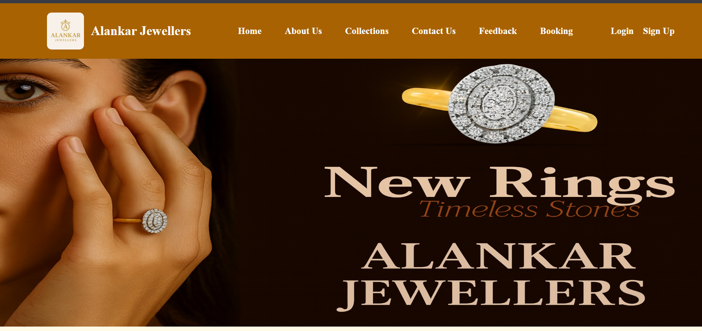
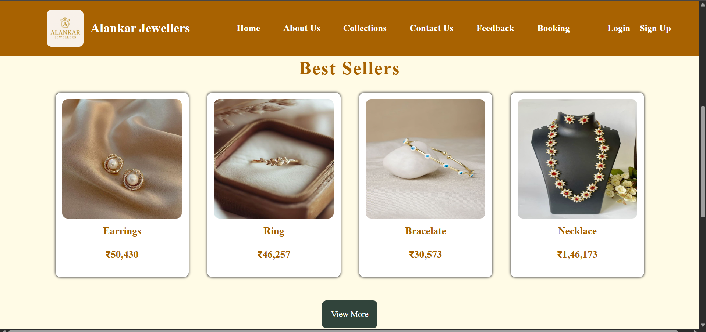
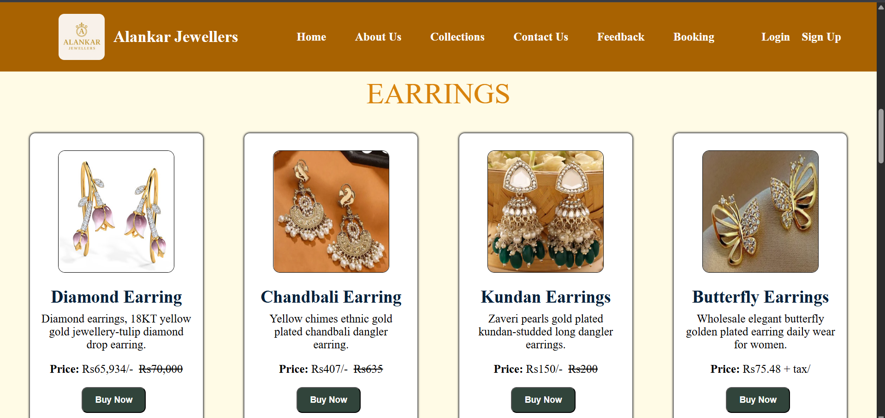
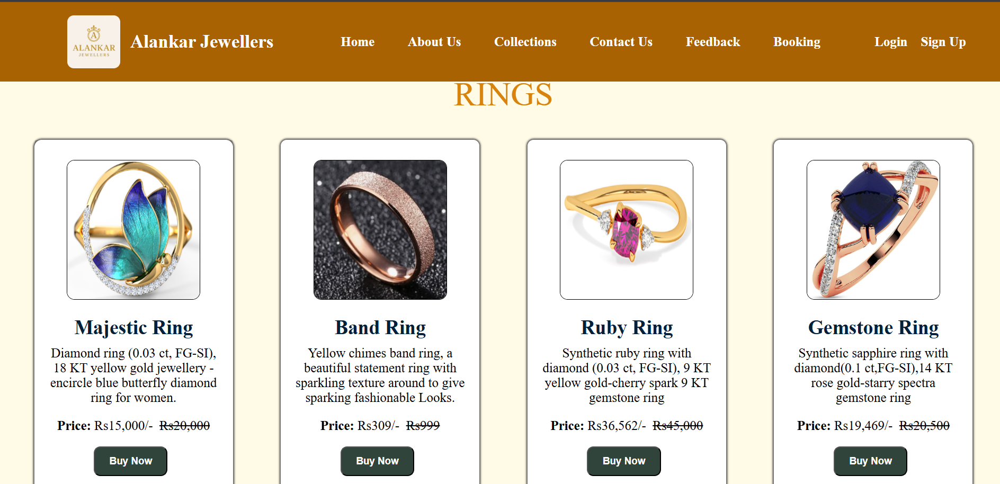
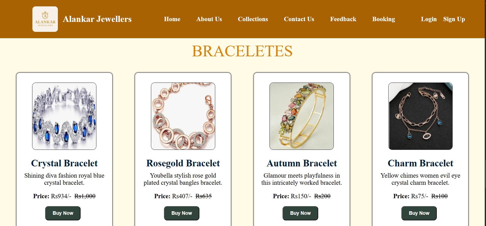

✨ **Alankar Jewellers – Modern Jewellery Website**

A fully responsive and beautifully designed jewellery shop website built using HTML & CSS.

  

📌 Project Overview

Alankar Jewellers is a modern and elegant jewellery website created using pure HTML and CSS.
This project showcases clean UI design, beautiful layouts, product sections, collection pages, and responsive components suitable for any jewellery store.

🚀 Live Demo

Netlify Link:
https://alankar-jewellary-shop.netlify.app/

**Feature**

✔️ Elegant and modern jewellery website

✔️ Fully responsive design

✔️ Navigation bar with logo

✔️ Product cards (Rings / Necklaces / earrings / More)

✔️ Collection pages

✔️ Smooth UI & layout

✔️ Attractive color palette

✔️ Clean code structure

**Screenshort of Home page**

**Screenshort of Collections page**

**Folder structure**
alankar-jewellers/
│
├── index.html
├── about.html
├── collections.html
├── contact.html
├── feedback.html
├── booking.html
├── login.html
├── signup.html
│
├── /assets
│   ├── /css
│   │    ├── style.css
│   │    └── responsive.css     <-- (Optional but recommended)
│   │
│   ├── /images
│   │    ├── logo.png
│   │    ├── banner.jpg
│   │    ├── earring.jpg
│   │    ├── ring.jpg
│   │    ├── bracelet.jpg
│   │    ├── necklace.jpg
│   │    └── other images...
│   │
│   ├── /icons
│   │    └── (social icons, menu icons, etc.)
│   │
│   └── /screenshots
│        ├── homepage.png
│        ├── collections.png
│        ├── footer.png
│        └── navbar.png
│
└── README.md
